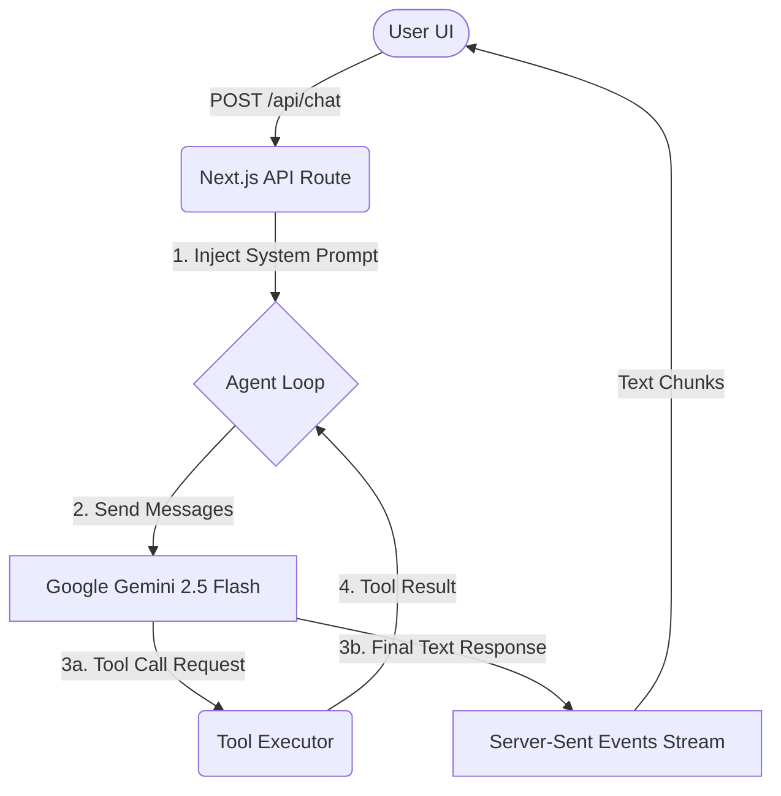

# Octaraa AI Chatbot Architecture

This document provides a comprehensive overview of the architecture for the Samaira AI Chatbot application. 

## 1. High-Level System Design

The application is built around a modern Next.js (App Router) stack. It utilizes an **Agentic RAG (Retrieval-Augmented Generation)** pattern. Rather than simply answering a prompt, the AI operates in a loop where it can decide to execute backend tools (like database lookups or vector searches) before compiling a final streaming response to the user.

## 2. Core Technologies

- **Frontend Framework:** Next.js (React 18), TailwindCSS
- **Backend / API:** Next.js Route Handlers (`src/app/api/chat/route.ts`)
- **LLM Engine:** Google Gemini 2.5 Flash (Using the official OpenAI-compatible REST endpoint)
- **Vector Database:** Pinecone
- **Relational Database:** Neon Serverless PostgreSQL
- **Web Scraper:** Puppeteer (with DOM `TreeWalker` for deep text extraction)

## 3. Data Flow & Components

### A. The Agent Loop (`route.ts`)
When a user sends a message, it hits the `/api/chat/route.ts` endpoint. 
1. The user's input is passed through **Input Guardrails** to filter out prompt injections or malicious requests.
2. The user's message is saved to PostgreSQL.
3. A `while` loop initiates, sending the conversation history to the Gemini LLM.
4. **Tool Execution:** If the LLM determines it needs external information (e.g., searching the FAQ, calculating an EMI, or updating a financial profile), it halts text generation and requests a tool call. The backend executes the requested JavaScript function in `src/lib/tools/index.ts` and returns the result back to the LLM.
5. This loop continues until the LLM has enough context to generate a final, human-readable response.
6. The final text is passed through **Output Guardrails** (adding disclaimers, stripping blocked phrases) and streamed to the client via Server-Sent Events (SSE).

### B. Retrieval-Augmented Generation (RAG) Pipeline
The chatbot is heavily grounded in Octaraa's specific documentation to prevent hallucinations.
- **Scraping (`scripts/scrape.ts`):** Uses Puppeteer to navigate the live Octaraa website. It utilizes a `TreeWalker` to deeply traverse the DOM, bypassing hidden React boundaries and modals to extract FAQs and raw text.
- **Embedding & Seeding (`scripts/seed-pinecone.ts`):** The extracted markdown data is chunked and embedded using Google's text-embedding models, then upserted into a Pinecone vector index (`octaraa-kb`).
- **HyDE Retrieval (`src/lib/tools/index.ts`):** When the AI searches the knowledge base, the system uses **Hypothetical Document Embeddings (HyDE)**. It asks a lightweight Gemini model to generate a "hypothetical" answer to the user's query, and uses that generated answer to perform the vector search against Pinecone, drastically improving semantic search accuracy.

### C. Persistent Storage (PostgreSQL)
A Neon PostgreSQL database tracks the state of the application:
- **Users & Sessions:** Tracks unique anonymous or authenticated user sessions.
- **Messages:** Logs all user queries, AI responses, and explicit tool-call logs for debugging and history rendering.
- **Profiles (`src/lib/profile.ts`):** The AI can autonomously update a user's financial profile (income, dependents, risk appetite, goals) in the database based on the conversation context.

### D. Guardrails & Compliance (`src/lib/guardrails.ts`)
Because this is a financial application, strict regulatory compliance is enforced via code:
- **Output Sanitization:** Regex-based checks prevent the AI from offering specific stock advice (e.g., "Buy Reliance") or guaranteeing returns.
- **Disclaimer Injection:** Automatically appends mandatory SEBI/educational disclaimers and Octaraa contact information to the end of the AI's final responses.
- **Prompt Restrictions:** The system prompt aggressively restricts the AI from claiming nonexistent features (like UI-based family trees or tax harvesting) and enforces reliance solely on the RAG tools.
